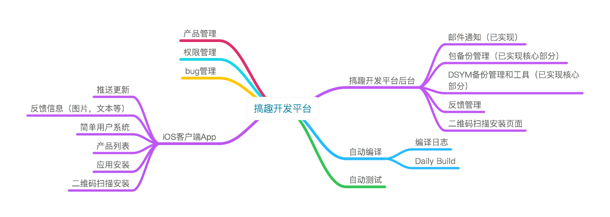
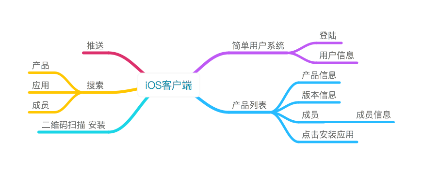
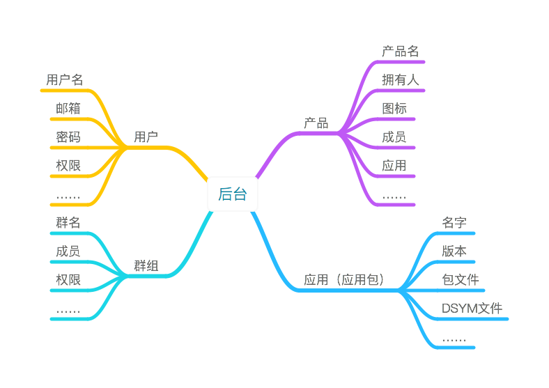
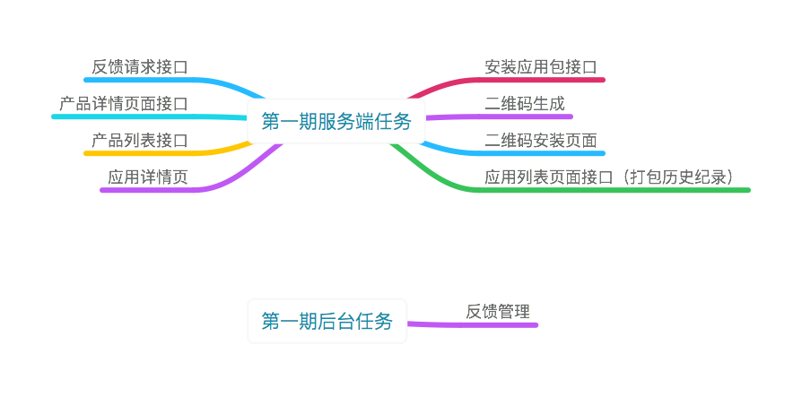
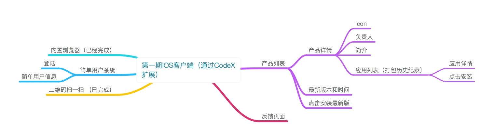

#### 版本说明
```
最新版本 v1.1 添加ipa包备份管理以及上传到蒲公英和对接jenkins
```


#### 简单介绍

```
G7Platform主要是通过开发自动编译，自动发布和自动测试这几个模
块来提高搞趣的开发和测试的工作效率。从而达到一定程度的自动化管理。
```

下图是目标做成的架构


iOS客户端


目前的进度已经实现后台管理部分的功能


#### 第一期的任务

第一期的任务 主要是完成二维码下载的功能以及客户端主要功能的开发

- 服务端主要任务
    * 二维码
    * ipa包安装
结构图如下:



- 客户端主要任务
  * 产品列表等
  * 产品和应用的详情页等
  * 简单登陆
结构图如下:



#### 完成时间安排

- 二月份主要任务:  二维码和ipa安装功能
- 三月份主要任务:  产品和简单登陆
